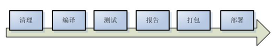
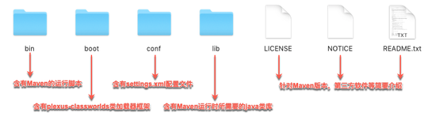
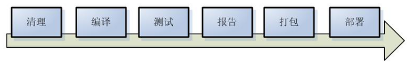
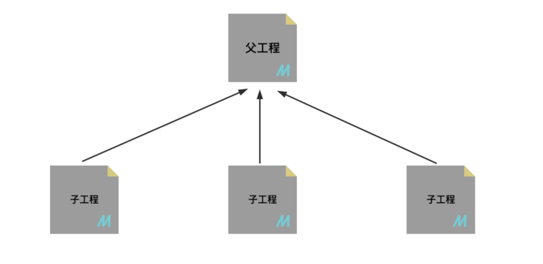
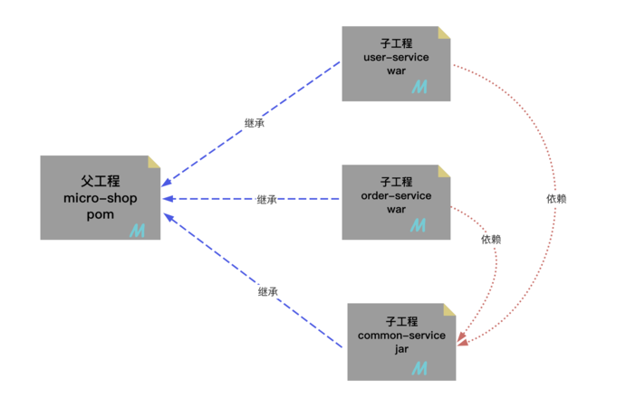

### Maven

Maven是一款为Java项目构建管理、依赖管理的工具（软件），使用Maven可以自动化构建、测试、打包和发布项目，大大提高了开发效率和质量

### Maven主要作用

#### 使用场景：

- 场景1:如我们项目需要第三方库，如Druid连接池、Mysql数据库驱动等。可以将需要的依赖项的信息编写到Maven工程的配置文件，Maven软件就会自动下载并复制这些依赖到项目中，也会自动下载依赖所需要的依赖。确保依赖版本的正确无冲突和依赖完整性

- 场景2:项目开发完成后，需要将项目打成.war文件，并部署到服务器中运行，使用Maven软件，我们可以通过一行构建命令(mvn package)快速项目构建和打包。节约大量时间。

#### 依赖管理：

Maven可以管理项目的依赖，包括自动下载所需依赖库、自动下载依赖需要的依赖并且保证版本没有冲突、依赖版本管理等。通过Maven，可以方便地维护项目所依赖的外部库，我们仅仅需要编写配置即可。

#### 构建管理：

项目构建是指将源代码、配置文件、资源文件等转化为能够过运行或部署的应用程序或库的过程

Maven可以管理项目的编译、测试、打包、部署等构建过程。通过实现标准的构建生命周期，Maven可以确保每一个构建过程都遵循同样的规则和最佳实践。同时，Maven的插件机制也使得开发者可以对构建过程进行扩展和定制。主动触发构建，只需要简单的命令操作即可。



### Maven安装

```shell
canvs@CanvsdeiMac bin % pwd
/Users/canvs/apache-maven-3.6.3/bin
canvs@CanvsdeiMac bin % export PATH="/Users/canvs/apache-maven-3.6.3/bin:$PATH"
canvs@CanvsdeiMac bin % mvn -version
Apache Maven 3.6.3 (cecedd343002696d0abb50b32b541b8a6ba2883f)
Maven home: /Users/canvs/apache-maven-3.6.3
Java version: 17.0.8, vendor: Oracle Corporation, runtime: /Library/Java/JavaVirtualMachines/jdk-17.jdk/Contents/Home
Default locale: zh_CN_#Hans, platform encoding: UTF-8
OS name: "mac os x", version: "12.6.1", arch: "x86_64", family: "mac"
canvs@CanvsdeiMac bin % 
```

#### 软件结构：



#### 配置文件

我们需要修改maven/conf/settings.xml配置文件，来修改maven的一些默认配置。我们主要修改的有三个配置

- 配置本地仓库地址

```xml
  <!-- localRepository
   | The path to the local repository maven will use to store artifacts.
   |
   | Default: ${user.home}/.m2/repository
  <localRepository>/path/to/local/repo</localRepository>
  -->
  <localRepository>/Users/canvs/repository</localRepository>
```

- 配置国内阿里镜像

```xml
  <mirrors>
    <!-- mirror
     | Specifies a repository mirror site to use instead of a given repository. The repository that
     | this mirror serves has an ID that matches the mirrorOf element of this mirror. IDs are used
     | for inheritance and direct lookup purposes, and must be unique across the set of mirrors.
     |
    <mirror>
      <id>mirrorId</id>
      <mirrorOf>repositoryId</mirrorOf>
      <name>Human Readable Name for this Mirror.</name>
      <url>http://my.repository.com/repo/path</url>
    </mirror>
     -->
      <mirror>
          <id>alimaven</id>
          <name>aliyun maven</name>
          <url>http://maven.aliyun.com/nexus/content/groups/public/</url>
          <mirrorOf>central</mirrorOf>
      </mirror>
  </mirrors>
```

- 配置jdk版本项目构建

```xml
  <profiles>
    <profile>
      <id>jdk-17</id>
      <activation>
        <activeByDefault>true</activeByDefault>
        <jdk>17</jdk>
      </activation>
      <properties>
        <maven.compiler.source>17</maven.compiler.source>
        <maven.compiler.target>17</maven.compiler.target>
        <maven.compiler.compilerVersion>17</maven.compiler.compilerVersion>
      </properties>
    </profile>
   </profiles>
```

### 梳理Maven工程GAVP属性

  > Maven工程相对之前的工程，多出一组gavp属性，gav需要我们在创建项目的时指定，p有默认值，后期通过配置文件修改。既然要填写的属性，我们先行了解下这组属性的含义!

  Maven 中的 GAVP 是指 GroupId、ArtifactId、Version、Packaging 等四个属性的缩写，其中前三个是必要的，而 Packaging 属性为可选项。这四个属性主要为每个项目在maven仓库总做一个标识，类似人的《姓-名》。有了具体标识，方便maven软件对项目进行管理和互相引用！

####  GAV遵循一下规则：

 **GroupID 格式**：com.{公司/BU }.业务线.[子业务线]，最多 4 级。

  说明：{公司/BU} 例如：alibaba/taobao/tmall/aliexpress 等 BU 一级；子业务线可选。

  正例：com.taobao.tddl 或 com.alibaba.sourcing.multilang  com.atguigu.java

**ArtifactID 格式**：产品线名-模块名。语义不重复不遗漏，先到仓库中心去查证一下。

  正例：tc-client / uic-api / tair-tool / bookstore

 **Version版本号格式推荐**：主版本号.次版本号.修订号 1.0.0

-  主版本号：当做了不兼容的 API 修改，或者增加了能改变产品方向的新功能。

-  次版本号：当做了向下兼容的功能性新增（新增类、接口等）。

-  修订号：修复 bug，没有修改方法签名的功能加强，保持 API 兼容性。

  例如： 初始→1.0.0  修改bug → 1.0.1  功能调整 → 1.1.1等

  **Packaging定义规则：**

- 指示将项目打包为什么类型的文件，idea根据packaging值，识别maven项目类型！

- packaging 属性为 jar（默认值），代表普通的Java工程，打包以后是.jar结尾的文件。

- packaging 属性为 war，代表Java的web工程，打包以后.war结尾的文件。

- packaging 属性为 pom，代表不会打包，用来做继承的父工程。

### Maven工程项目结构

Maven是一个强大的构建工具，它提供一种标准化的项目结构，可以帮助开发者更容易的管理项目的依赖、构建、测试和发布等任务。

```shell
|-- pom.xml                               # Maven 项目管理文件 
|-- src
    |-- main                              # 项目主要代码
    |   |-- java                          # Java 源代码目录
    |   |   `-- com/example/myapp         # 开发者代码主目录
    |   |       |-- controller            # 存放 Controller 层代码的目录
    |   |       |-- service               # 存放 Service 层代码的目录
    |   |       |-- dao                   # 存放 DAO 层代码的目录
    |   |       `-- model                 # 存放数据模型的目录
    |   |-- resources                     # 资源目录，存放配置文件、静态资源等
    |   |   |-- log4j.properties          # 日志配置文件
    |   |   |-- spring-mybatis.xml        # Spring Mybatis 配置文件
    |   |   `-- static                    # 存放静态资源的目录
    |   |       |-- css                   # 存放 CSS 文件的目录
    |   |       |-- js                    # 存放 JavaScript 文件的目录
    |   |       `-- images                # 存放图片资源的目录
    |   `-- webapp                        # 存放 WEB 相关配置和资源
    |       |-- WEB-INF                   # 存放 WEB 应用配置文件
    |       |   |-- web.xml               # Web 应用的部署描述文件
    |       |   `-- classes               # 存放编译后的 class 文件
    |       `-- index.html                # Web 应用入口页面
    `-- test                              # 项目测试代码
        |-- java                          # 单元测试目录
        `-- resources                     # 测试资源目录
```

- pom.xml：Maven项目管理文件，用于描述项目的依赖和构建配置等信息
- src/main/java：存放项目的Java源代码
- src/main/resources：存放项目的资源文件，如配置文件、静态资源等
- src/main/webapp/WEB-INF：存放Web应用的配置文件
- src/main/webapp/index.html：Web应用的入口页面
- src/test/java：存放项目测试代码
- src/test/resources：存放测试相关的资源文件，如测试配置文件等。

### 依赖管理和配置

Maven依赖管理是Maven软件中最重要的功能之一。Maven的依赖管理能够帮助开发人员自动解决软件包依赖问题，使得开发人员能够轻松地将其他开发人员的模块或第三方框架集成到自己的应用程序或模块中，避免出现版本冲突和依赖缺失等问题。

通过定义POM文件，Maven能够自动解析项目的依赖关系，并通过Maven仓库自动下载和管理依赖，从而避免了手动下载和管理依赖的繁琐工作和可能引发的版本冲突问题。

#### maven项目信息属性配置和读取

```xml
<!-- 模型版本 -->
<modelVersion>4.0.0</modelVersion>
<!-- 公司或者组织的唯一标志，并且配置时生成的路径也是由此生成， 如com.companyname.project-group，maven会将该项目打成的jar包放本地路径：/com/companyname/project-group -->
<groupId>com.companyname.project-group</groupId>
<!-- 项目的唯一ID，一个groupId下面可能多个项目，就是靠artifactId来区分的 -->
<artifactId>project</artifactId>
<!-- 版本号 -->
<version>1.0.0</version>

<!--打包方式
    默认：jar
    jar指的是普通的java项目打包方式！ 项目打成jar包！
    war指的是web项目打包方式！项目打成war包！
    pom不会讲项目打包！这个项目作为父工程，被其他工程聚合或者继承！后面会讲解两个概念
-->
<packaging>jar/pom/war</packaging>
```

#### 依赖管理和添加

```xml
<!-- 
   通过编写依赖jar包的gav必要属性，引入第三方依赖！
   scope属性是可选的，可以指定依赖生效范围！
   依赖信息查询方式：
      1. maven仓库信息官网 https://mvnrepository.com/
      2. mavensearch插件搜索
 -->
<dependencies>
    <!-- 引入具体的依赖包 -->
    <dependency>
        <groupId>log4j</groupId>
        <artifactId>log4j</artifactId>
        <version>1.2.17</version>
        <!--
            生效范围
            - compile ：main目录 test目录  打包打包 [默认]
            - provided：main目录 test目录  Servlet
            - runtime： 打包运行           MySQL
            - test:    test目录           junit
         -->
        <scope>runtime</scope>
    </dependency>

</dependencies>
```

#### 依赖版本提取和维护

```xml
<!--声明版本-->
<properties>
  <!--命名随便,内部制定版本号即可！-->
  <junit.version>4.11</junit.version>
  <!-- 也可以通过 maven规定的固定的key，配置maven的参数！如下配置编码格式！-->
  <project.build.sourceEncoding>UTF-8</project.build.sourceEncoding>
  <project.reporting.outputEncoding>UTF-8</project.reporting.outputEncoding>
</properties>

<dependencies>
  <dependency>
    <groupId>junit</groupId>
    <artifactId>junit</artifactId>
    <!--引用properties声明版本 -->
    <version>${junit.version}</version>
  </dependency>
</dependencies>
```

#### 依赖传递和冲突

依赖传递指的是当一个模块或库A依赖于另一个模块B，而B又依赖于模块C，那么A会间接依赖于C。这种依赖传递结构可以形成一个依赖树。当我们引入一个库或框架时，maven会自动解析和加载其所有的直接和间接依赖，确保这些依赖都可用。

##### 依赖传递的作用是：

- 减少重复依赖：当多个项目依赖同一个库时，maven可以自动下载并且只下载一次该库。这样可以减少项目的构建时间和磁盘空间。
- 自动管理依赖：maven可以自动管理依赖项，使用依赖传递，简化了依赖项的管理，使项目构建更加可靠和一致。
- 确保依赖版本的正确性：通过依赖传递的依赖，之间不会存在版本兼容性问题，确保依赖的版本正确性

如项目中，需要导入jackson相关的依赖，jackson需要导入三个依赖。分别为Jackson Databind、Jackson Core、Jackson Annotations；通过查看网站介绍的依赖传递特性：data-bind中依赖其他两个依赖。直接导入data-bind即可，会自动依赖传递需要的依赖

```xml
<!-- https://mvnrepository.com/artifact/com.fasterxml.jackson.core/jackson-databind -->
<dependency>
    <groupId>com.fasterxml.jackson.core</groupId>
    <artifactId>jackson-databind</artifactId>
    <version>2.15.2</version>
</dependency>

```

#### 依赖导入失败场景和解决方案

在使用maven构建项目时，有可能会发生依赖项下载错误的情况

- 下载依赖时出现网络故障，导致无法连接至Maven仓库，从而无法下载依赖
- 依赖项的版本号或配置文件中的版本号错误，或者依赖项没有正确定义，导致maven下载的依赖项与实际需要的不一致，从而引发错误。
- 本地Maven仓库或缓存被污染或损坏，导致maven无法正确的使用现有的依赖项，并且也无法重新下载。

解决方案：

- 清除本地Maven仓库缓存（lastUpdate）文件，因为只要存在lastUpdate缓存文件，刷新也不会重新下载。本地仓库名中，根据雨来的gav属性异常向下查找文件夹，最终删除内部的文件，刷新重新下载即可。

#### 构建管理和插件配置

项目构建是指将源代码、依赖库和资源文件等转换成可执行可部署的应用程序的过程，在这个过程中包括编译源代码、链接依赖库、打包和部署等多个步骤。



**主动触发场景**：

- 重新编译：编译不充分，部分文件没有被编译
- 打包：独立部署到外部服务器软件打包部署
- 部署本地或者私服仓库：maven工程加入到本地或私服仓库，供其他工程使用

**命令方式构建**：

| 命令        | 描述                                         |
| ----------- | -------------------------------------------- |
| mvn clean   | 清理编译或打包后的项目结构，删除target文件夹 |
| mvn compile | 编译项目，生成target文件夹                   |
| mvn test    | 执行测试源码                                 |
| mvn site    | 生成一个项目依赖信息的展示页面               |
| mvn package | 打包项目，生成war/jar文件                    |
| mvn install | 打包后上传到maven本地仓库部署                |
| mvn deploy  | 只打包，上传到maven私服仓库部署              |

**构建命令周期**

构建生命周期可以理解为一组固定构建命令的有序集合，触发周期后的命令，会自动触发周期前的命令。

- 清理周期：主要是对项目编译文件就行清理：clean
- 默认周期：定义了真正构建时所需要执行的所有步骤，它是生命周期中最核心的部分：compile - test -package - install / deploy
- 报告周期：site

```shell
打包：mvn clean package
重新编译：mvn clean compile
本地部署：mvn clean install
```

**插件配置**

```xml
<build>
   <!-- jdk17 和 war包版本插件不匹配 -->
    <plugins>
        <plugin>
            <groupId>org.apache.maven.plugins</groupId>
            <artifactId>maven-war-plugin</artifactId>
            <version>3.2.2</version>
        </plugin>
    </plugins>
</build>
```

### Maven继承和聚合特性

#### Maven工程继承关系

Maven继承是指在Maven的项目中，让一个项目从另一个项目中继承配置信息的机制。继承可以让我们在多个项目中共享同一配置信息，简化项目的管理和维护工作。



#### 继承作用

在父工程中统一管理项目中的依赖信息，进行统一版本管理

**背景：**

- 对一个比较大型的项目进行了模块拆分
- 一个project下面，创建了很多个module
- 每一个module都需要配置自己的依赖信息

**需求**

- 多个模块要使用同一个框架，它们应该是同一个版本，所以整个项目中使用的框架版本需要统一管理
- 使用框架时需要的jar包组合需要经过长期摸索和反复调试，最终确定一个可用组合。这个耗费很大精力中介出来的方案不应该在新的项目中重新摸索。

通过在父工程中为整个项目维护依赖信息的组合既保证了整个项目使用规范、准确的jar包；又能够将以往的经验沉淀下来，节约时间和精力。

#### Maven工程聚合关系

Maven聚合是指将多个项目组织到一个父级项目中，通过触发工程的构建，统一按顺序触发子工程构建的过程

#### 聚合的作用

- 统一管理子项目构建：通过聚合，可以将多个子项目组织在一起，方便管理和维护
- 优化构建顺序：通过聚合，可以对多个项目进行顺序控制，避免出现构建依赖混乱导致构建失败的情况

### Maven实战案例

#### 项目需要和结构分析



需求案例：搭建一个电商平台项目，该平台包括用户服务、订单服务、通用工具模块等。

项目架构：

1. 用户服务：负责处理用户相关的逻辑，例如用户信息的管理、用户注册、登录等。
2. 订单服务：负责处理订单相关的逻辑，例如订单的创建、订单支付、退货、订单查看等。
3. 通用模块：负责存储其他服务需要通用工具类，其他服务依赖此模块。

服务依赖：

1. 用户服务 (1.0.1)
    - spring-context 6.0.6 
    - spring-core 6.0.6
    - spring-beans 6.0.6
    - jackson-databind /  jackson-core / jackson-annotations 2.15.0 
2. 订单服务 (1.0.1)
    - shiro-core 1.10.1 
    - spring-context 6.0.6 
    - spring-core 6.0.6
    - spring-beans 6.0.6
3. 通用模块 (1.0.1)
    - commons-io 2.11.0

**父工程pom.xml**

```xml
<?xml version="1.0" encoding="UTF-8"?>
<project xmlns="http://maven.apache.org/POM/4.0.0"
         xmlns:xsi="http://www.w3.org/2001/XMLSchema-instance"
         xsi:schemaLocation="http://maven.apache.org/POM/4.0.0 http://maven.apache.org/xsd/maven-4.0.0.xsd">
    <modelVersion>4.0.0</modelVersion>

    <groupId>com.canvs</groupId>
    <artifactId>micro-shop</artifactId>
    <version>1.0-SNAPSHOT</version>
    <packaging>pom</packaging>
    <modules>
        <module>user-service</module>
        <module>order-service</module>
        <module>common-service</module>
    </modules>
    <properties>
        <spring.version>6.0.6</spring.version>
        <jackson.version>2.15.0</jackson.version>
        <shiro.version>1.10.1</shiro.version>
        <commons-io.version>2.11.0</commons-io.version>
    </properties>
    <dependencyManagement>
        <dependencies>
            <!-- https://mvnrepository.com/artifact/org.springframework/spring-context -->
            <dependency>
                <groupId>org.springframework</groupId>
                <artifactId>spring-context</artifactId>
                <version>${spring.version}</version>
            </dependency>
            <!-- https://mvnrepository.com/artifact/com.fasterxml.jackson.core/jackson-databind -->
            <dependency>
                <groupId>com.fasterxml.jackson.core</groupId>
                <artifactId>jackson-databind</artifactId>
                <version>${jackson.version}</version>
            </dependency>
            <!-- https://mvnrepository.com/artifact/org.apache.shiro/shiro-core -->
            <dependency>
                <groupId>org.apache.shiro</groupId>
                <artifactId>shiro-core</artifactId>
                <version>${shiro.version}</version>
            </dependency>
            <!-- https://mvnrepository.com/artifact/commons-io/commons-io -->
            <dependency>
                <groupId>commons-io</groupId>
                <artifactId>commons-io</artifactId>
                <version>${commons-io.version}</version>
            </dependency>

        </dependencies>
    </dependencyManagement>
    <build>
        <plugins>
            <plugin>
                <groupId>org.apache.maven.plugins</groupId>
                <artifactId>maven-war-plugin</artifactId>
                <version>3.2.2</version>
            </plugin>
        </plugins>
    </build>
</project>
```

**user-service pom.xml**

```xml
<?xml version="1.0" encoding="UTF-8"?>
<project xmlns="http://maven.apache.org/POM/4.0.0"
         xmlns:xsi="http://www.w3.org/2001/XMLSchema-instance"
         xsi:schemaLocation="http://maven.apache.org/POM/4.0.0 http://maven.apache.org/xsd/maven-4.0.0.xsd">
    <modelVersion>4.0.0</modelVersion>
    <parent>
        <groupId>com.canvs</groupId>
        <artifactId>micro-shop</artifactId>
        <version>1.0-SNAPSHOT</version>
    </parent>

    <artifactId>user-service</artifactId>
    <dependencies>
        <!-- https://mvnrepository.com/artifact/org.springframework/spring-context -->
        <dependency>
            <groupId>org.springframework</groupId>
            <artifactId>spring-context</artifactId>
        </dependency>
        <!-- https://mvnrepository.com/artifact/com.fasterxml.jackson.core/jackson-databind -->
        <dependency>
            <groupId>com.fasterxml.jackson.core</groupId>
            <artifactId>jackson-databind</artifactId>
        </dependency>
    </dependencies>
</project>
```

**order-service pom.xml**

```xml
<?xml version="1.0" encoding="UTF-8"?>
<project xmlns="http://maven.apache.org/POM/4.0.0"
         xmlns:xsi="http://www.w3.org/2001/XMLSchema-instance"
         xsi:schemaLocation="http://maven.apache.org/POM/4.0.0 http://maven.apache.org/xsd/maven-4.0.0.xsd">
    <modelVersion>4.0.0</modelVersion>
    <parent>
        <groupId>com.canvs</groupId>
        <artifactId>micro-shop</artifactId>
        <version>1.0-SNAPSHOT</version>
    </parent>

    <artifactId>order-service</artifactId>
    <dependencies>
        <!-- https://mvnrepository.com/artifact/org.springframework/spring-context -->
        <dependency>
            <groupId>org.springframework</groupId>
            <artifactId>spring-context</artifactId>
        </dependency>
        <dependency>
            <groupId>org.apache.shiro</groupId>
            <artifactId>shiro-core</artifactId>
        </dependency>
    </dependencies>

</project>
```

**common-service pom.xml**

```xml
<?xml version="1.0" encoding="UTF-8"?>
<project xmlns="http://maven.apache.org/POM/4.0.0"
         xmlns:xsi="http://www.w3.org/2001/XMLSchema-instance"
         xsi:schemaLocation="http://maven.apache.org/POM/4.0.0 http://maven.apache.org/xsd/maven-4.0.0.xsd">
    <modelVersion>4.0.0</modelVersion>
    <parent>
        <groupId>com.canvs</groupId>
        <artifactId>micro-shop</artifactId>
        <version>1.0-SNAPSHOT</version>
    </parent>

    <artifactId>common-service</artifactId>

    <dependencies>
        <!-- https://mvnrepository.com/artifact/commons-io/commons-io -->
        <dependency>
            <groupId>commons-io</groupId>
            <artifactId>commons-io</artifactId>
        </dependency>
    </dependencies>
</project>
```

